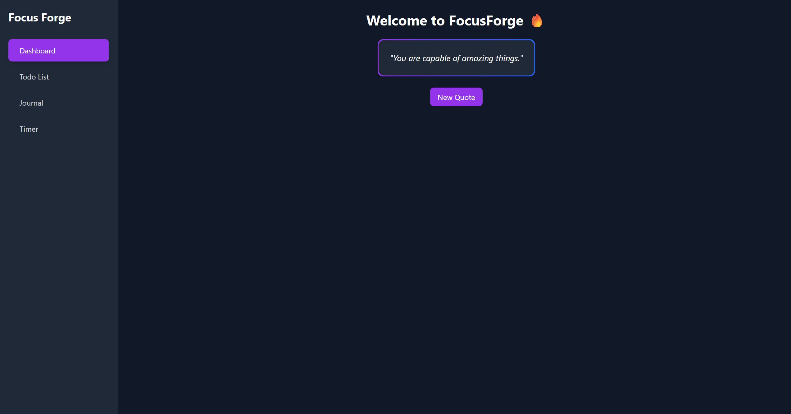
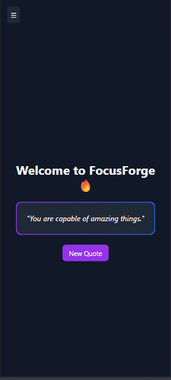
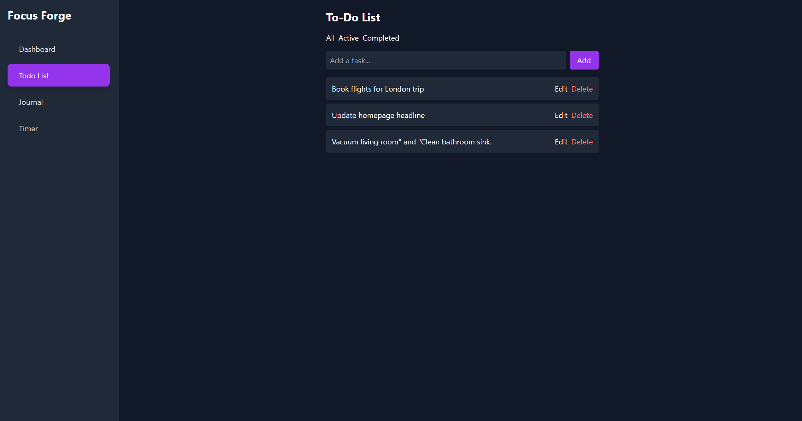
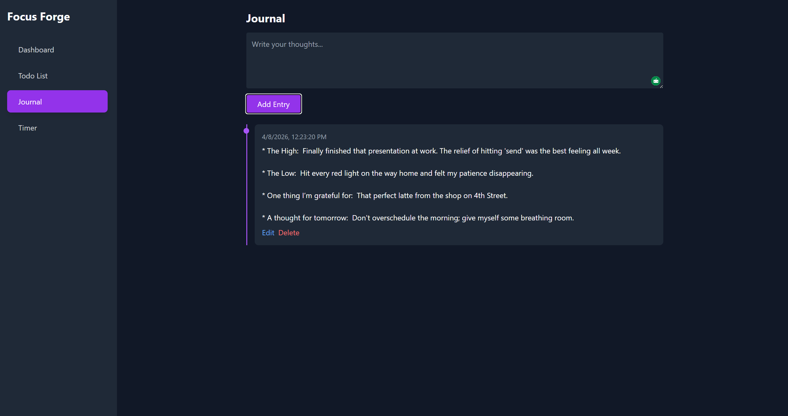
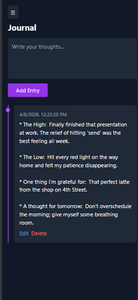
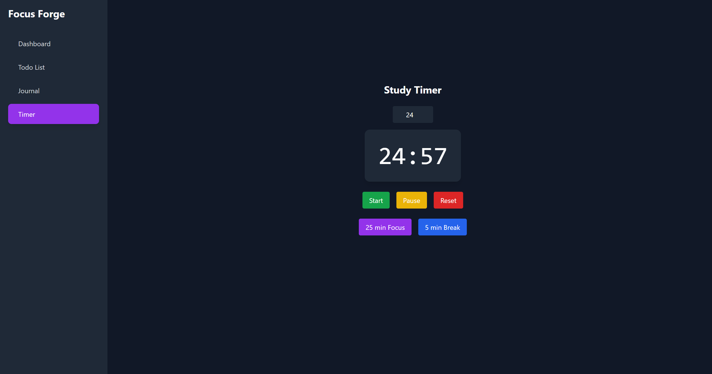
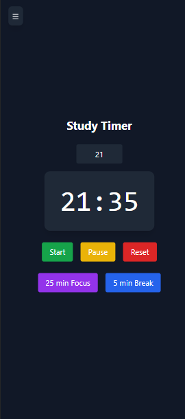

# 🔥 FocusForge – Productivity PWA


---

## 📖 Overview

**FocusForge** is a modern Progressive Web App (PWA) designed to help students stay focused, organized, and motivated during self-study sessions.

It combines:

* 🧠 Motivation
* ✅ Task Management
* 📓 Journaling
* ⏱️ Pomodoro Timer

—all in one clean, responsive, and installable application.

---

## ✨ Features

### 💬 Motivational Messages

* 10+ predefined motivational quotes
* Random quote generator
* Smooth UI transitions

---

### 📝 To-Do List

* Add, edit, delete tasks
* Mark tasks as complete
* Filter (All / Active / Completed)
* Press **Enter** to quickly add tasks
* Persistent storage using localStorage

---

### 📓 Journal

* Create, edit, delete entries
* Scrollable timeline view
* Displays date & time for each entry
* Fully stored locally

---

### ⏱️ Study Timer (Pomodoro)

* Custom time input
* Presets: 25 min focus / 5 min break
* Start / Pause / Resume / Reset
* Timer persists across reloads

---

### 📱 Responsive Design

* Mobile-first approach
* Sidebar → Burger menu on mobile
* Optimized for:

  * 📱 Mobile
  * 💻 Desktop
  * 📲 Tablet

---

### 🚀 Progressive Web App (PWA)

* Installable on desktop & mobile
* Works offline
* Custom icons & manifest
* App-like experience

---

## 🖼️ Screenshots

> *(Add your screenshots here for better presentation)*

### Dashboard

, 

### To-Do List

,   

### Journal

,   

### Timer

,   

---

## 🛠️ Tech Stack

* **React (v19+)**
* **Vite (v7+)**
* **JavaScript (ES6+)**
* **Tailwind CSS**
* **React Router**
* **vite-plugin-pwa**
* **LocalStorage**

---

## 📂 Project Structure

```
src/
 ├── components/
 │    └── Sidebar.jsx
 ├── pages/
 │    ├── Dashboard.jsx
 │    ├── Todo.jsx
 │    ├── Journal.jsx
 │    └── Timer.jsx
 ├── hooks/
 │    └── useLocalStorage.js
 ├── utils/
 │    └── quotes.js
 ├── App.jsx
 ├── main.jsx
```

---

## 🚀 Getting Started

### 1️⃣ Clone the Repository

```bash
git clone <your-repo-url>
cd focus-forge
```

---

### 2️⃣ Install Dependencies

```bash
npm install
```

---

### 3️⃣ Run Development Server

```bash
npm run dev
```

Open:

```
http://localhost:5173
```

---

### 4️⃣ Build for Production

```bash
npm run build
```

---

### 5️⃣ Preview Production Build

```bash
npm run preview
```

---

## 📲 Install as an App (PWA)

### 💻 Desktop (Chrome / Edge)

* Click **Install icon** in address bar

---

### 📱 Android

1. Open in Chrome
2. Tap menu (⋮)
3. Tap **Add to Home Screen**

---

### 🍎 iOS (Safari)

1. Open in Safari
2. Tap **Share**
3. Tap **Add to Home Screen**

---

## 🌐 Offline Support

* Uses service worker caching
* Works without internet after first load
* Fully functional offline

---

## 💾 Data Storage

All data is stored locally using **localStorage**:

* Tasks
* Journal entries
* Timer state

No backend or authentication required.

---

## 🎨 Design Philosophy

* Minimal & distraction-free
* Dark theme with modern gradients
* Smooth UX interactions
* Mobile-first responsiveness

---

## 🚀 Deployment

This app can be deployed to:

* **nuwebspace** (course requirement)
* Netlify
* Vercel

> ⚠️ Ensure HTTPS for PWA functionality

---

## ⚠️ Notes

* `node_modules/` is excluded from submission
* Ensure production build works before submitting
* PWA install works best in production mode

---

## 👨‍💻 Author

Developed as part of coursework demonstrating:

* React development
* Progressive Web Apps (PWA)
* UI/UX design
* State management & persistence

---

## ⭐ Final Thoughts

FocusForge is a complete productivity solution built with modern web technologies. It demonstrates both technical skills and thoughtful user experience design, making it a strong candidate for a high-grade submission.

---

> 💡 *Tip: Add real screenshots before submitting — it makes a BIG difference on GitHub.*
